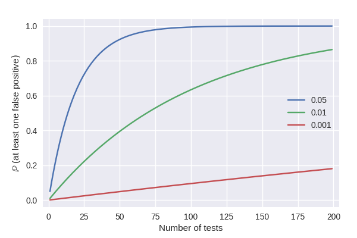
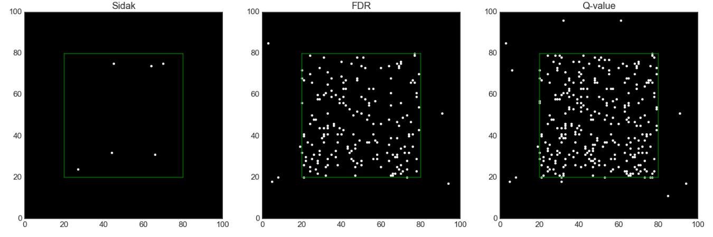

# MultiPy
Testing multiple hypotheses simultaneously increases the number of false 
positive findings if the corresponding p-values are not corrected. While this 
multiple testing problem is well known, the classic and advanced correction 
methods are yet to be implemented into a coherent Python package. This package 
sets out to fill this gap by implementing methods for controlling the 
family-wise error rate (FWER) and the false discovery rate (FDR).



## News

* MultiPy is presented as a poster in the <a href="https://megnord.org/">MEG Nord</a> conference at Jyväskylä, Finland (8–10th May 2019)

* MultiPy is presented in a neuroscience seminar at the <a href="https://cibr.jyu.fi/en">Jyväskylä Centre for Interdisciplinary Brain Research</a>, Jyväskylä, Finland (30th November 2018)

* MultiPy is presented in the <a href="https://blogs.helsinki.fi/ils-blogs/2018/05/24/tom-30-05/">Tool of the month seminar</a> at the University of Helsinki, Finland (30th May 2018)

* MultiPy is presented as a poster in the <a href="https://www.helsinki.fi/en/conferences/neuronal-circuit-dynamics-across-scales-and-species">Neuronal circuit dynamics across scales and species symposium</a> at Helsinki, Finland (3–4th May 2018)

## Installation

Install the software manually to get the latest version. The pip version is 
updated approximately every two or three months.

### Using pip

```bash
pip install multipy
```

### Manually

```
git clone https://github.com/puolival/multipy.git
cd multipy/
ipython setup.py install
```

### Dependencies

The required packages are 
<a href="http://www.numpy.org/">NumPy</a> (version 1.10.2 or later),
<a href="https://www.scipy.org/">SciPy</a> (version 0.17.0 or later),
<a href="https://matplotlib.org/">Matplotlib</a> (version 2.1.0 or later),
<a href="https://seaborn.pydata.org">Seaborn</a> (version 0.8.0 or later), and
<a href="http://scikit-image.org/">scikit-image</a> (version 0.13.0 or later). 
The program codes also probably work with recent earlier versions of these 
packages but this has not been tested.

## Problems or suggestions?

Please open an <a href="https://github.com/puolival/multipy/issues/new">issue</a>
if you find a bug or have an idea how the software could be improved.

## Methods for controlling the FWER

- Bonferroni correction
- Šidák correction [1]
- Hochberg's procedure [2]
- Holm-Bonferroni procedure [3]
- Permutation tests [8, 10]
- Random field theory (RFT) based approaches [9, 11]

### Quick example
```python
from multipy.data import neuhaus
from multipy.fwer import sidak

pvals = neuhaus()
significant_pvals = sidak(pvals, alpha=0.05)
print(zip(['{:.4f}'.format(p) for p in pvals], significant_pvals))
```
```python
[('0.0001',  True), ('0.0004',  True), ('0.0019',  True), ('0.0095', False), ('0.0201', False), 
 ('0.0278', False), ('0.0298', False), ('0.0344', False), ('0.0459', False), ('0.3240', False), 
 ('0.4262', False), ('0.5719', False), ('0.6528', False), ('0.7590', False), ('1.0000', False)]
```

## Methods for controlling the FDR

- Benjamini-Hochberg procedure (the classic FDR procedure) [4]
- Storey-Tibshirani q-value procedure [5]
- Adaptive linear step-up procedure [6–7]
- Two-stage linear step-up procedure [7]

### Quick example
```python
from multipy.fdr import lsu
from multipy.data import neuhaus

pvals = neuhaus()
significant_pvals = lsu(pvals, q=0.05)
print(zip(['{:.4f}'.format(p) for p in pvals], significant_pvals))
```
```python
[('0.0001',  True), ('0.0004',  True), ('0.0019',  True), ('0.0095',  True), ('0.0201', False), 
 ('0.0278', False), ('0.0298', False), ('0.0344', False), ('0.0459', False), ('0.3240', False), 
 ('0.4262', False), ('0.5719', False), ('0.6528', False), ('0.7590', False), ('1.0000', False)]
```

## Covariate-adjusted methods

- Independent hypothesis weighting (IHW) [17]

## Data and models

- Spatial two-group model [12]
- Spatial separate-classes model. Partly based on [12–13].



There is a true effect at each location within the green box and no true effects outside.

## Methods for reproducibility analyses

- The FWER replicability method [14–16]
- The FDR r-value method [18] (work in progress)

## Data visualization

### Quick example

Visualize q-values similar to Storey and Tibshirani (2003).

```python
from multipy.data import two_group_model
from multipy.fdr import qvalue
from multipy.viz import plot_qvalue_diagnostics

tstats, pvals = two_group_model(N=25, m=1000, pi0=0.5, delta=1)
_, qvals = qvalue(pvals)
plot_qvalue_diagnostics(tstats, pvals, qvals)
```


## Citation

A manuscript of the software is currently being prepared.

### Poster presentations:

Puoliväli T, Palva S, Palva JM (2019): MultiPy: Multiple hypothesis testing
in Python. *MEG Nord*, Jyväskylä, Finland, 8–10th May

Puoliväli T, Lobier M, Palva S, Palva JM (2018): MultiPy: Multiple hypothesis 
testing in Python. *Neuronal Circuit Dynamics across Scales and Species*, 
Helsinki, Finland, 3–4th May.

## References

[1] Sidak Z (1967): Confidence regions for the means of multivariate normal 
distributions. *Journal of the American Statistical Association* 
62(318):626–633.

[2] Hochberg Y (1988): A sharper Bonferroni procedure for multiple tests of 
significance. *Biometrika* 75(4):800–802.

[3] Holm S (1979): A simple sequentially rejective multiple test procedure. 
*Scandinavian Journal of Statistics* 6(2):65–70.

[4] Benjamini Y, Hochberg Y (1995): Controlling the false discovery rate: 
A practical and powerful approach to multiple testing. *Journal of Royal 
Statistical Society. Series B (Methodological)*: 57(1):289–300.

[5] Storey JD, Tibshirani R (2003): Statistical significance for genomewide
studies. *The Proceedings of the National Academy of the United States of 
America* 100(16):9440–9445.

[6] Benjamini Y, Hochberg Y (2000): On the adaptive control of the false 
discovery rate in multiple testing with independent statistics. *Journal of 
Educational and Behavioral Statistics* 25:60–83.

[7] Benjamini Y, Krieger AM, Yekutieli D (2006): Adaptive linear step-up 
procedures that control the false discovery rate. *Biometrika* 93(3):491–507.

[8] Maris E, Oostenveld R (2007): Nonparametric statistical testing of EEG-
and MEG-data. *Journal of Neuroscience Methods* 164(1):177–190.

[9] Brett M, Penny W, Kiebel S (2003): An introduction to random field 
theory. *Human Brain Function* (2nd edition). 
[<a href="https://www.fil.ion.ucl.ac.uk/spm/doc/books/hbf2/">full text</a>]

[10] Phipson B, Smyth GK (2010): Permutation p-values should never ber zero:
Calculating exact p-values when permutations are randomly drawn. *Statistical
Applications in Genetics and Molecular Biology* 9:article39.

[11] Worsley KJ, Evans AC, Marrett S, Neelin P (1992): A three-dimensional
statistical analysis for CBF activation studies in human brain. *Journal of
Cerebral Blood Flow and Metabolism* 12:900–918.

[12] Bennett CM, Wolford GL, Miller MB (2009): The principled control of
false positives in neuroimaging. *Social Cognitive and Affective
Neuroscience* 4(4):417–422.

[13] Efron B (2008): Simultaneous inference: When should hypothesis testing
problems be combined? *The Annals of Applied Statistics* 2(1):197–223.

[14] Benjamini Y, Heller R (2008): Screening for partial conjuction hypotheses.
*Biometrics* 64:1215–1222.

[15] Benjamini Y, Heller Y, Yekutieli D (2009): Selective inference in 
complex research. *Philosophical Transactions of the Royal Society A* 
367:4255–4271.

[16] Bogomolov M, Heller R (2013): Discovering findings that replicate from a
primary study high dimension to a follow-up study. *Journal of the American 
Statistical Association* 108(504):1480–1492.

[17] Ignatiadis N, Klaus B, Zaugg JB, Huber W (2016): Data-driven hypothesis
weighting increases detection power in genome-scale multiple testing. *Nature
Methods* 13:577–580

[18] Heller R, Bogomolov M, Benjamini Y (2014): Deciding whether follow-up
studies have replicated findings in a preliminary large-scale omics study.
*The Proceedings of the National Academy of Sciences of the United States
of America* 111(46):16262–16267.
