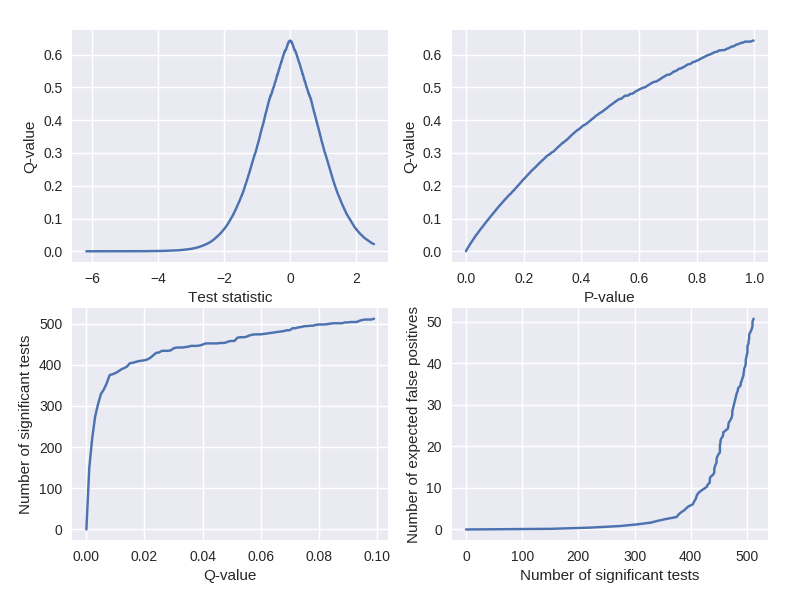

# MultiPy
Testing multiple hypotheses simultaneously increases the number of false 
positive findings if the corresponding p-values are not corrected. While this 
multiple testing problem is well known, the classic and advanced correction 
methods are yet to be implemented into a coherent Python package. This package 
sets out to fill this gap by implementing methods for controlling the 
family-wise error rate (FWER) and the false discovery rate (FDR).

## Installation

Install the software manually to get the latest version. The pip version is 
updated approximately once per month.

### Using pip

```bash
pip install multipy
```

### Manually

```
git clone https://github.com/puolival/multipy.git
cd multipy/
ipython setup.py install
```

### Dependencies

The required packages are 
<a href="http://www.numpy.org/">NumPy</a> (version 1.10.2 or later),
<a href="https://www.scipy.org/">SciPy</a> (version 0.17.0 or later),
<a href="https://matplotlib.org/">Matplotlib</a> (version 2.1.0 or later), and
<a href="https://seaborn.pydata.org">Seaborn</a> (version 0.8.0 or later). 
The program codes also probably work with recent earlier versions of these 
packages but this has not been tested.

## Methods for controlling the FWER

- Bonferroni correction
- Šidák correction [1]
- Hochberg's procedure [2]
- Holm-Bonferroni procedure [3]

### Quick example
```python
from multipy.data import neuhaus
from multipy.fwer import sidak

pvals = neuhaus()
significant_pvals = sidak(pvals, alpha=0.05)
print zip(['{:.4f}'.format(p) for p in pvals], significant_pvals)
```
```python
[('0.0001',  True), ('0.0004',  True), ('0.0019',  True), ('0.0095', False), ('0.0201', False), 
 ('0.0278', False), ('0.0298', False), ('0.0344', False), ('0.0459', False), ('0.3240', False), 
 ('0.4262', False), ('0.5719', False), ('0.6528', False), ('0.7590', False), ('1.0000', False)]
```

## Methods for controlling the FDR

- Benjamini-Hochberg procedure (the classic FDR procedure) [4]
- Storey-Tibshirani q-value procedure [5]
- Adaptive linear step-up procedure [6–7]
- Two-stage linear step-up procedure [7]
- Permutation tests [8] (work in progress)

### Quick example
```python
from multipy.fdr import lsu
from multipy.data import neuhaus

pvals = neuhaus()
significant_pvals = lsu(pvals, q=0.05)
print zip(['{:.4f}'.format(p) for p in pvals], significant_pvals)
```
```python
[('0.0001',  True), ('0.0004',  True), ('0.0019',  True), ('0.0095',  True), ('0.0201', False), 
 ('0.0278', False), ('0.0298', False), ('0.0344', False), ('0.0459', False), ('0.3240', False), 
 ('0.4262', False), ('0.5719', False), ('0.6528', False), ('0.7590', False), ('1.0000', False)]
```

## Data visualization

### Quick example

Visualize q-values similar to Storey and Tibshirani (2003).

```python
from multipy.data import two_group_model
from multipy.fdr import qvalue
from multipy.viz import plot_qvalue_diagnostics

tstats, pvals = two_group_model(N=25, m=1000, pi0=0.5, delta=1)
_, qvals = qvalue(pvals)
plot_qvalue_diagnostics(tstats, pvals, qvals)
```


## Citation

Puoliväli T, Lobier M, Palva S, Palva JM (2018): MultiPy: Multiple hypothesis 
testing in Python. https://puolival.github.io/multipy/

## References

[1] Sidak Z (1967): Confidence regions for the means of multivariate normal 
distributions. *Journal of the American Statistical Association* 
62(318):626–633.

[2] Hochberg Y (1988): A sharper Bonferroni procedure for multiple tests of 
significance. *Biometrika* 75(4):800–802.

[3] Holm S (1979): A simple sequentially rejective multiple test procedure. 
*Scandinavian Journal of Statistics* 6(2):65–70.

[4] Benjamini Y, Hochberg Y (1995): Controlling the false discovery rate: 
A practical and powerful approach to multiple testing. *Journal of Royal 
Statistical Society. Series B (Methodological)*: 57(1):289–300.

[5] Storey JD, Tibshirani R (2003): Statistical significance for genomewide
studies. *The Proceedings of the National Academy of the United States of 
America* 100(16):9440–9445.

[6] Benjamini Y, Hochberg Y (2000): On the adaptive control of the false 
discovery rate in multiple testing with independent statistics. *Journal of 
Educational and Behavioral Statistics* 25:60–83.

[7] Benjamini Y, Krieger AM, Yekutieli D (2006): Adaptive linear step-up 
procedures that control the false discovery rate. *Biometrika* 93(3):491–507.

[8] Maris E, Oostenveld R (2007): Nonparametric statistical testing of EEG-
and MEG-data. *Journal of Neuroscience Methods* 164(1):177–190.
